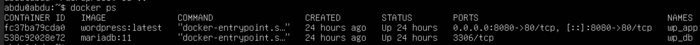
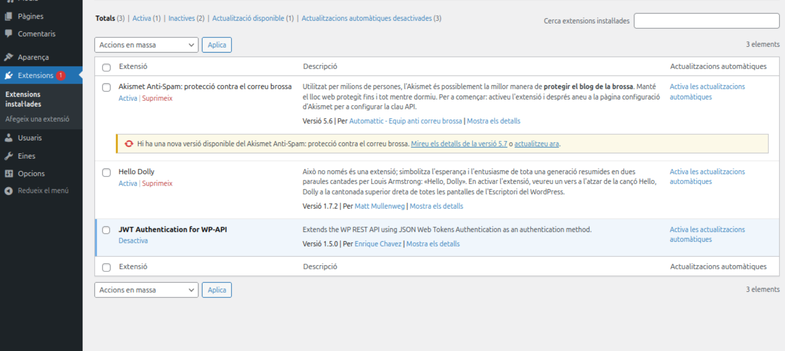
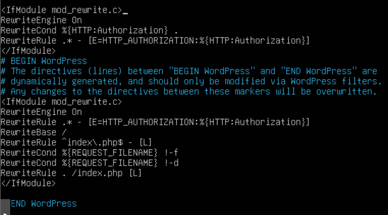
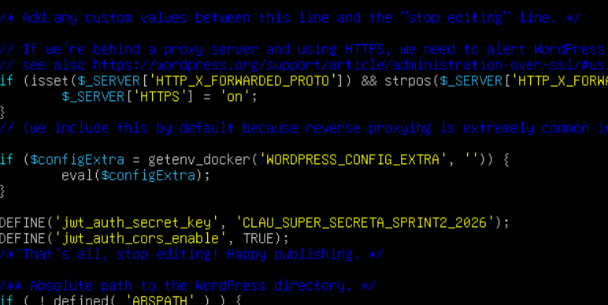
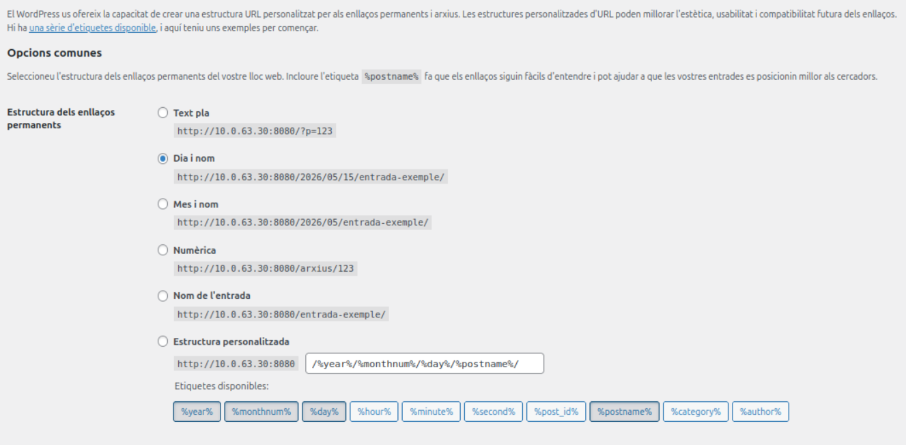
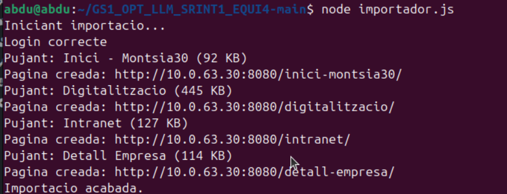
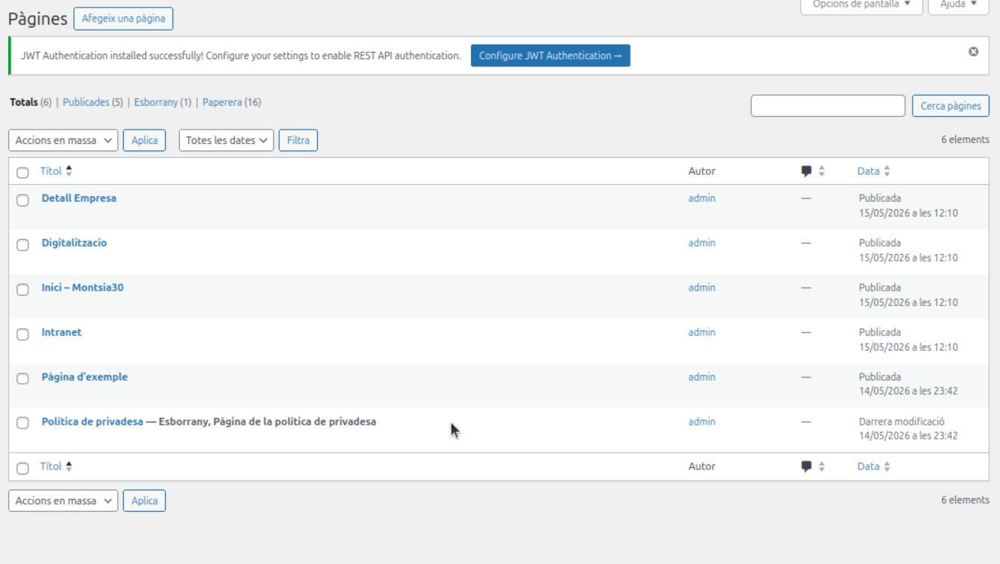
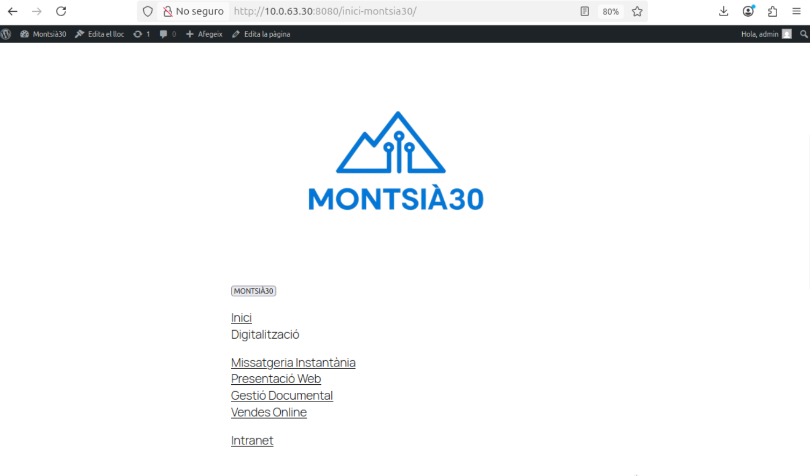

# Sprint 2 — Bolcat de dades a WordPress · Montsià30

**Assignatura:** SMX2 - 0228 Aplicacions Web  
**Curs:** 25-26  

## Descripció del projecte

L'objectiu d'aquest projecte és transferir les pàgines HTML del Sprint 1 (projecte Montsià30) a WordPress de forma automàtica, utilitzant la **REST API de WordPress** amb autenticació **JWT (JSON Web Token)**.

L'script `importador.js` s'encarrega de tot el procés:
1. S'autentica a WordPress i obté un token JWT
2. Llegeix cada fitxer HTML del Sprint 1
3. Inlinea el CSS de cada pàgina perquè es vegi amb estils a WordPress
4. Codifica totes les imatges en base64 perquè no depenguin de rutes externes
5. Corregeix tots els links de navegació per apuntar a les URLs reals de WordPress
6. Envia el contingut via `POST /wp-json/wp/v2/pages`

---

## Fitxers del Sprint 1 seleccionats

| Fitxer | Pàgina WordPress | Motiu |
|--------|-----------------|-------|
| `index.html` | Inici - Montsia30 | Pàgina principal amb el logo i els botons de navegació |
| `Digitalització/digitalitzacio.html` | Digitalitzacio | Carrusel amb les 4 seccions de digitalització |
| `Intranet/intranet.html` | Intranet | Sistema de login, registre i llistat d'empreses amb filtres |
| `Intranet/detall-empresa.html` | Detall Empresa | Vista de detall d'una empresa amb estat de digitalització i sostenibilitat |

---

## Vídeo de demostració

https://youtu.be/S5vetVGwDZE

---

## Requisits previs

- Ubuntu Server 24.04 amb Docker i Docker Compose
- Ubuntu Desktop 24.04 amb Node.js v18+
- Connexió de xarxa entre les dues màquines

---

## Guia pas a pas

### FASE 1 — Instal·lar WordPress al Server amb Docker

**1.1 Instal·lar Docker**

```bash
sudo apt update && sudo apt upgrade -y
sudo apt install -y docker.io docker-compose
sudo systemctl enable --now docker
sudo usermod -aG docker $USER
newgrp docker
```

**1.2 Crear el fitxer docker-compose.yml**

```bash
mkdir ~/wordpress && cd ~/wordpress
nano docker-compose.yml
```

```yaml
services:
  db:
    image: mariadb:11
    container_name: wp_db
    restart: unless-stopped
    environment:
      MARIADB_DATABASE: wordpress
      MARIADB_USER: wpuser
      MARIADB_PASSWORD: wp_pass_123
      MARIADB_ROOT_PASSWORD: root_pass_123
    volumes:
      - db_data:/var/lib/mysql

  wordpress:
    image: wordpress:latest
    container_name: wp_app
    restart: unless-stopped
    depends_on:
      - db
    ports:
      - "8080:80"
    environment:
      WORDPRESS_DB_HOST: db:3306
      WORDPRESS_DB_NAME: wordpress
      WORDPRESS_DB_USER: wpuser
      WORDPRESS_DB_PASSWORD: wp_pass_123
    volumes:
      - wp_data:/var/www/html

volumes:
  db_data:
  wp_data:
```

**1.3 Arrencar WordPress**

```bash
docker compose up -d
docker ps
```



Els dos contenidors `wp_app` i `wp_db` han d'aparèixer amb status `Up`.

**1.4 Instal·lar WordPress**

Des del Desktop, accedeix a `http://10.0.63.30:8080` i omple el formulari d'instal·lació:
- Nom del lloc: `Montsià30`
- Usuari: `admin`
- Contrasenya: la teva contrasenya

---

### FASE 2 — Configurar JWT al WordPress

**2.1 Instal·lar el plugin JWT**

wp-admin → Extensions → Afegeix una extensió nova → cerca **JWT Authentication for WP-API** (autor: Enrique Chavez) → Instal·la → Activa.



**2.2 Modificar .htaccess**

```bash
docker exec -it wp_app bash
apt update && apt install -y nano
nano /var/www/html/.htaccess
```

Afegir **JUST ABANS** de `# BEGIN WordPress`:

```apache
<IfModule mod_rewrite.c>
RewriteEngine On
RewriteCond %{HTTP:Authorization} .
RewriteRule .* - [E=HTTP_AUTHORIZATION:%{HTTP:Authorization}]
</IfModule>
```



**2.3 Modificar wp-config.php**

```bash
nano /var/www/html/wp-config.php
```

Afegir **JUST ABANS** de `/* That's all, stop editing! */`:

```php
define('JWT_AUTH_SECRET_KEY', 'clau_super_secreta_sprint2_2026');
define('JWT_AUTH_CORS_ENABLE', true);
```



```bash
exit
```

**2.4 Configurar Permalinks**

wp-admin → Opcions → Enllaços permanents → selecciona **"Nom de l'entrada"** → Desa.



---

### FASE 3 — Executar l'script d'importació

**3.1 Instal·lar Node.js al Desktop**

```bash
sudo apt install -y nodejs npm
node --version
```

**3.2 Col·locar l'script a la carpeta del Sprint 1**

Copia `importador.js` a la mateixa carpeta que `index.html`.

**3.3 Configurar l'script**

Obre `importador.js` i canvia la IP:

```javascript
const WP_URL = "http://10.0.63.30:8080";
const USER   = "admin";
const PASS   = "la_teva_contrasenya";
```

**3.4 Executar**

```bash
cd ~/GS1_OPT_LLM_SRINT1_EQUI4-main
node importador.js
```



---

### FASE 4 — Verificar a WordPress

wp-admin → Pàgines — apareixen les 4 pàgines creades automàticament.



Pàgina visible al frontend:



---

## Com funciona l'script importador.js

### Flux del procés

```
importador.js
    │
    ├─ 1. POST /wp-json/jwt-auth/v1/token
    │      { username, password }
    │      ← { token: "eyJ0eXAi..." }
    │
    └─ Per cada pàgina (index, digitalitzacio, intranet, detall-empresa):
          ├─ Llegir fitxer HTML
          ├─ inlinearCSS()  → elimina <link> i afegeix <style> amb el CSS real
          ├─ inlinearImatges() → converteix src="imatge.png" a base64
          ├─ arreglarLinks() → substitueix rutes relatives per URLs de WordPress
          ├─ inlinearJS()   → inclou el JS amb els links ja corregits
          └─ POST /wp-json/wp/v2/pages
                 Authorization: Bearer TOKEN
                 { title, content: { raw: html }, status: "publish" }
                 ← { id: 5, link: "http://..." }
```

### Per què s'inlinea el CSS i les imatges?

Les pàgines del Sprint 1 usen fitxers CSS i imatges externs amb rutes relatives. Quan WordPress rep l'HTML, no pot accedir a aquests fitxers locals. Per solucionar-ho:

- **CSS inline:** l'script llegeix cada fitxer `.css`, elimina les etiquetes `<link>` i afegeix tot el CSS dins d'un bloc `<style>`.
- **Imatges en base64:** l'script llegeix cada fitxer d'imatge, el codifica en base64 i substitueix el `src="imatge.png"` per `src="data:image/png;base64,..."`.
- **Links corregits:** totes les rutes relatives (`../index.html`, `Digitalització/digitalitzacio.html`...) es substitueixen per les URLs reals de WordPress.

---

## Problemes trobats i solucions

| Problema | Causa | Solució |
|----------|-------|---------|
| `docker compose up -d` dona error | Versió antiga de docker-compose | Usar `docker-compose up -d` amb guió |
| JWT retorna 404 | Permalinks no configurats | Canviar a "Nom de l'entrada" a wp-admin |
| Error 403 en el token | Header Authorization no arriba a PHP | Afegir el bloc al .htaccess fora del bloc WordPress |
| Pàgines sense estil | CSS extern amb rutes relatives | Funció `inlinearCSS()` ho resol |
| Imatges no apareixen | Rutes relatives locals | Funció `inlinearImatges()` les codifica en base64 |
| `node: command not found` | Node.js no instal·lat | `sudo apt install -y nodejs npm` |

---

## Tecnologies utilitzades

- **WordPress** — CMS allotjat amb Docker
- **MariaDB** — Base de dades de WordPress
- **Docker + Docker Compose** — Contenidors per al servidor
- **JWT Authentication for WP-API** — Plugin per a l'autenticació
- **REST API de WordPress** — `POST /wp-json/wp/v2/pages`
- **Node.js** — Execució de l'script
- **fetch** (Node.js v18+) — Peticions HTTP a la REST API

---

*SMX2 - 0228 Aplicacions Web · Institut Montsià · Curs 25-26*
